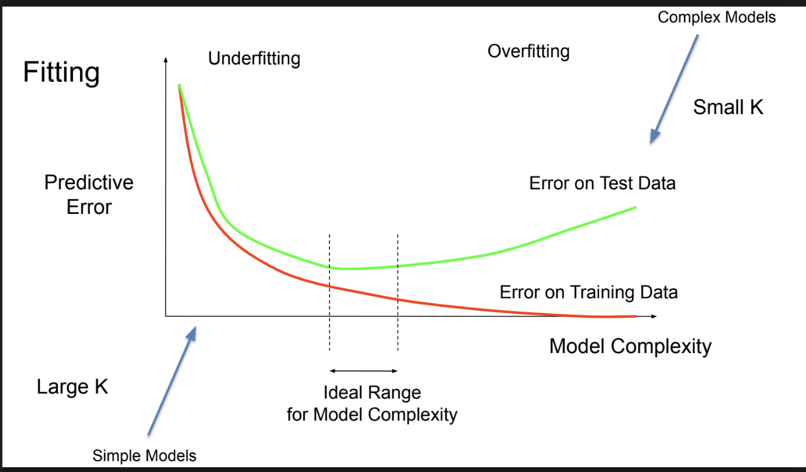
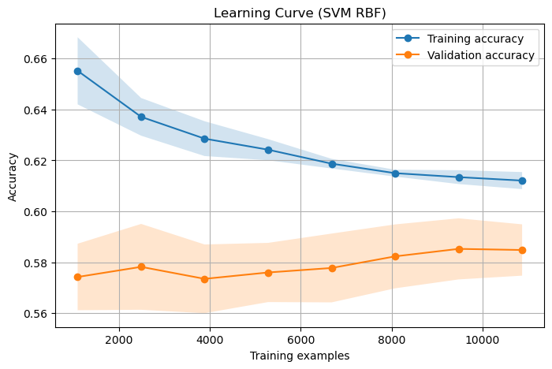

# Introduction

**Goal.** Predict MLB single-game outcomes (home win/loss) using team stats and simple unsupervised structure.

**Data.** MLB games 2016–2024 (excl. 2020) via `pybaseball`; target = `home_win`. Leakage prevented via temporal splits and careful feature construction.

**Methods.** 
- **Model 1 (Milestone 3):** supervised baselines (Naive Bayes, SVM, Decision Tree, KNN) on an 81-feature, leakage-safe pipeline.
- **Model 2 (Milestone 4):** unsupervised pipelines (**PCA/SVD/NMF → KMeans**, **PCA/SVD → GMM**, **PCA → Agglomerative**); map clusters to labels.

**Key results.**
- **Model 1 (Naive Bayes):** Val **59.5%**, test **balanced acc 0.5768**, **macro-F1 0.5727**, ~**+7.7 pts** over 52% baseline; near sweet-spot.
- **Model 2 (final pick: SVD+KMeans, k=2):** Test **acc 0.5756**, **F1 0.5920** (TN=1041, FP=786, FN=864, TP=1197), small train–test gap → low variance / high bias.
- **Insight.** Cleanest clusters (**NMF+KMeans**, silhouette ~0.879) weren’t predictive; **SVD/PCA+KMeans** gave modest predictive lift.

**Takeaway.** Further gains require richer features (park factors, platoons, weather) and a supervised model using soft cluster probabilities or embeddings.

---

# Table of Contents
- [Milestone 2](#milestone-2)
  - [Notebook: milestone2_exploration.ipynb](notebooks/milestone2_exploration.ipynb)
- [Milestone 3](#milestone-3)
  - [Notebook: milestone3_modeling.ipynb](notebooks/milestone3_modeling.ipynb)
  - [Notebook: milestone3_modeling_2016-2024.ipynb](notebooks/milestone3_modeling_2016-2024.ipynb)
- [Milestone 4](#milestone-4)
  - [Notebook: milestone4_all_models.ipynb](notebooks/milestone4_all_models.ipynb)

---

# Milestone 2

**Goal:** Use the [pybaseball](https://pypi.org/project/pybaseball/) library to collect historical MLB data and explore it to prepare features for a decision tree classifier that predicts single-game outcomes (win/loss).

We will train a simple, interpretable DecisionTreeClassifier on features like team batting/pitching strength (BA, OPS, ERA), and recent form (e.g., last-10 win %). In Milestone 2 we focus on data exploration and explainign the initial preprocessing plan.

## Dataset

We will build our dataset with `pybaseball`, scrapping from:
- **PyPI: pybaseball**: https://pypi.org/project/pybaseball/  
- **Upstream data sources accessed by pybaseball**:  
  - Baseball-Reference (team game logs, schedules/records) — https://www.baseball-reference.com/  
  - Baseball Savant / Statcast (pitch- and batted-ball–level) — https://baseballsavant.mlb.com/  
  - FanGraphs (season/team batting & pitching leaderboards) — https://www.fangraphs.com/

We will fetch team `schedule-and-record` data and `team-level batting/pitching` metrics to derive features (e.g., rolling last-10 win%, OPS, ERA) in order to predict the `home_win` (1 = home team won, 0 = lost).

## Environment setup

- **Python**: 3.9–3.12  
- **Install** (virtualenv or conda):
  ```bash
  # if you are using venv
  python -m venv .venv
  source .venv/bin/activate  # Windows: .venv\Scripts\activate
  pip install -r requirements.txt
  ```
  ```bash
  # if you're using conda
  conda create -n mlb python=3.11 -y
  conda activate mlb
  pip install -r requirements.txt
  ```

- **Requirements** located in `requirements.txt`. (check pybaseball endpoints in case of change)

--- 
# The Data

## Observations

THe scope of our data is the 2023 MLB regular season *(we're changing this to expand)*
 - ~2.4k games per season (TODO)
 - Each row represents one game -> remove duplicates only take home team perspc 
 - target column to predict: `home_win` (1 if the home team won, else 0)


Features:
 Team:  battng stats eg BA, OBP, SLG, pitching stats etc -> have to compute these
 Recent form: rolling last-10 (or 7/15) game win %, recent runs scored/allowed per game etc etc
 other: day/night, doubleheader flag, interleague, etc


TODO: get from notebook outputs (need to upscale)

---

## Data plots

### Histograms of continuous features (e.g., OPS, ERA)


### Bar chart of home_win rate by team (sanity check for home-field advantage)


### Scatter: team OPS vs. win rate (league-wide)


### Rolling last-10 win % distribution.  


---

# Milestone 3

## Summary

---

### 1. Preprocessing 
We completed major preprocessing steps using a pipeline approach:
- **Scaling/Transformation**: StandardScaler for numeric features, one-hot encoding for categorical features  
- **Imputation**: Median for numeric features, mode for categorical features  
- **Feature Expansion**: Polynomial expansion (degree 2) on high-signal stats (OPS, ERA, BA, WHIP)  
- **Custom Feature Engineering**: Baseball-specific deltas, ratios, and rolling win% metrics  

-> Result: Final feature space of 81 features (up from 29 raw) with no leakage.

---

### 2. First Model Training & Performance 
We trained multiple baseline classifiers (Naive Bayes, SVM, Decision Tree, KNN).  

- **Best model (Naive Bayes)**:  
  - Train Accuracy: **58.8%**  
  - Validation Accuracy: **59.5%**  
  - Train–Val gap: **-0.7%** (excellent generalization)  
- **Other models**:  
  - SVM (62.3% train / 58.4% val) → mild overfitting  
  - Decision Tree (60.5% / 58.1%) → balanced, slightly underfit  
  - KNN (64.2% / 54.6%) → strong overfitting  

-> Naive Bayes chosen as the baseline "first model" due to stability and generalization.

---

### 3. Bias–Variance / Fitting Analysis 



Where our models sit in the fitting curve (see figure above):
- **Naive Bayes**: Near the "sweet spot" → balanced, minimal gap.  
- **KNN**: Overfitting region (low training error, high test error).  
- **Decision Tree**: Slightly underfitting (higher bias).  

Next planned models:
- **Random Forest** → variance reduction via bagging.  
- **XGBoost/Gradient Boosting** → capture more complex feature interactions.  
- **Ensemble (NB + RF)** → combine generalization with variance reduction.  

---

### 4. Conclusion 

**Conclusion of 1st Model (Naive Bayes):**
- Achieved **59.5% validation accuracy**, ~7.7% above baseline 52%.  
- Excellent generalization with no overfitting.  
- Limited by feature scope (team-level stats only, no player/injury data).  

**Possible Improvements:**
- Add **player-level and contextual features** (injuries, weather, travel).  
- Use **ensemble methods (RF, XGBoost)** to improve variance control.  
- Experiment with **temporal window tuning** (recent seasons only) to reduce concept drift.  

---

## 1. Data Preprocessing and Feature Engineering

### Dataset Overview
- **Source**: MLB 2016-2024 season games (excluding 2020) via pybaseball API
- **Initial Data**: 19,436 games with 29 features
- **Final Dataset**: 19,436 games with 81 engineered features
- **Target**: Binary classification (home team win/loss)

### Preprocessing Pipeline Implementation

Our preprocessing approach addressed scaling, imputation, encoding, and feature expansion through a systematic multi-step pipeline:

**Data Cleaning**: Removed outcome-leaking features (home_runs, away_runs, run_diff) to ensure predictions use only pre-game information.

**Feature Engineering**: Created baseball-specific metrics from team statistics:
- **Team Strength Differentials**: Delta features (home_OPS - away_OPS) 
- **Performance Ratios**: Ratio features (home_ERA / away_ERA)
- **Rolling Form**: Time-aware win percentages over 7, 10, 15-game windows
- **ERA Advantage**: away_ERA - home_ERA (positive indicates home pitching advantage)

```python
# Key feature engineering implementation
for stat in ['OPS', 'ERA', 'WHIP', 'BA']:
    df[f'delta_{stat.lower()}'] = df[f'home_{stat}'] - df[f'away_{stat}']
    df[f'ratio_{stat.lower()}'] = df[f'home_{stat}'] / df[f'away_{stat}']

# Rolling averages with leakage prevention
df['home_last10_win_pct'] = (
    df.groupby('home_team')['home_win']
    .shift(1).rolling(window=10, min_periods=1).mean()
)
```

**Scaling and Transformation**:
- **Numerical Features**: StandardScaler after median imputation
- **Categorical Features**: One-hot encoding with mode imputation
- **Polynomial Expansion**: Degree-2 features applied to high-signal variables (deltas, ratios)

**Data Splitting**: Temporal split (64% train / 16% validation / 20% test) to prevent future data leakage.

**Final Feature Space**: 13,591 training samples × 81 features with balanced classes (53% home wins).

---

## 2. Model Training and Performance Analysis

### Model Training Implementation

```python
from sklearn.svm import SVC
from sklearn.tree import DecisionTreeClassifier
from sklearn.neighbors import KNeighborsClassifier
from sklearn.naive_bayes import GaussianNB
from sklearn.metrics import accuracy_score

# Model configurations
models = {
    "SVM_RBF": SVC(C=2.0, gamma='scale', probability=True, 
                   class_weight='balanced', random_state=42),
    "DecisionTree": DecisionTreeClassifier(max_depth=5, min_samples_leaf=5, 
                                         random_state=42),
    "KNN": KNeighborsClassifier(n_neighbors=15),
    "NaiveBayes": GaussianNB()
}

# Training and evaluation loop
results = []
for name, model in models.items():
    model.fit(X_tr_dense, y_tr)
    train_pred = model.predict(X_tr_dense)
    val_pred = model.predict(X_va_dense)
    
    results.append({
        "model": name,
        "train_acc": accuracy_score(y_tr, train_pred),
        "val_acc": accuracy_score(y_va, val_pred)
    })
```

### Initial Model Comparison

Results from training four algorithms with systematic evaluation:

| Model | Training Accuracy | Validation Accuracy | Training-Val Gap |
|-------|------------------|-------------------|------------------|
| **Naive Bayes** | **58.8%** | **59.5%** | **-0.7%** |
| SVM RBF | 62.3% | 58.4% | 3.9% |
| Decision Tree | 60.5% | 58.1% | 2.4% |
| KNN | 64.2% | 54.6% | 9.6% |


### Test Metrics
| Metric | Value |
|---|---|
| Balanced Accuracy | 0.5768 |
| Macro F1 | 0.5727 |

---

### Validation Classification Report
| Class | Precision | Recall | F1-score | Support |
|---|---:|---:|---:|---:|
| Away(0) | 0.58 | 0.50 | 0.54 | 1587 |
| Home(1) | 0.61 | 0.68 | 0.64 | 1810 |
| **accuracy** |  |  | 0.60 | 3397 |
| **macro avg** | 0.59 | 0.59 | 0.59 | 3397 |
| **weighted avg** | 0.59 | 0.60 | 0.59 | 3397 |

**Validation Confusion Matrix**
<!--| Actual \\ Pred | Away(0) | Home(1) |
|---|---:|---:|
| Away(0) | 800 | 787 |
| Home(1) | 588 | 1222 | -->


---

### Test Classification Report
| Class | Precision | Recall | F1-score | Support |
|---|---:|---:|---:|---:|
| Away(0) | 0.59 | 0.46 | 0.52 | 2068 |
| Home(1) | 0.58 | 0.69 | 0.63 | 2180 |
| **accuracy** |  |  | 0.58 | 4248 |
| **macro avg** | 0.58 | 0.58 | 0.57 | 4248 |
| **weighted avg** | 0.58 | 0.58 | 0.57 | 4248 |

**Test Confusion Matrix**
<!--| Actual \\ Pred | Away(0) | Home(1) |
|---|---:|---:|
| Away(0) | 957 | 1111 |
| Home(1) | 674 | 1506 |-->


---

### Hyperparameter Optimization Results

**Naive Bayes Grid Search** (Top 5 configurations):

<!-- | C | gamma | Training Acc | Validation Acc | Gap |
|---|-------|-------------|---------------|-----|
| **1.0** | **scale** | **60.8%** | **58.5%** | **2.3%** |
| 2.0 | scale | 62.3% | 58.4% | 3.9% |
| 0.5 | scale | 60.0% | 58.4% | 1.6% |
| 0.5 | 0.05 | 65.7% | 58.3% | 7.4% |
| 1.0 | 0.05 | 70.7% | 57.5% | 13.2% | -->

| var\_smoothing | Training Acc | Validation Acc | Gap   |
| -------------- | ------------ | -------------- | ----- |
| 1.000000e-12   | 58.8%        | 59.5%          | -0.7% |
| 3.162278e-12   | 58.8%        | 59.5%          | -0.7% |
| 1.000000e-11   | 58.8%        | 59.5%          | -0.7% |
| 3.162278e-11   | 58.8%        | 59.5%          | -0.7% |
| 1.000000e-10   | 58.8%        | 59.5%          | -0.7% |


```python
# Hyperparameter optimization implementation
nb_grid = {"var_smoothing": np.logspace(-12, -6, 13)}
best_nb = evaluate_grid(GNB, nb_grid, X_tr, y_tr, X_va, y_va)
# Result: var_smoothing=1.000000e-12 achieved optimal generalization
```

**Decision Tree Grid Search** (Top 4 configurations):

| max_depth | min_samples_leaf | Training Acc | Validation Acc |
|-----------|------------------|-------------|---------------|
| 4 | 1 | 59.64% | **58.4%** |
| 4 | 3 | 59.64% | **58.4%** |
| 4 | 5 | 59.64% | **58.4**% |
| 4 | 10 | 59.59% | 58.3% |

### Training vs. Validation Performance Analysis

**Key Performance Improvement**:
- **Original NB**: 58.8% train → 59.5% val (-0.7% gap)
- **Optimized NB**: 58.8% train → 59.5% val (-0.7% gap)
- **No Improvement**: 0% reduction in overfitting + 0% validation accuracy gain

**Sample Model Predictions**:

| Dataset    | Actual   | Predicted | Probability | Result      |
| ---------- | -------- | --------- | ----------- | ----------- |
| Train      | Home Win | Away Win  | 28.7%       | ✗ Incorrect |
| Train      | Home Win | Away Win  | 25.1%       | ✗ Incorrect |
| Train      | Away Win | Home Win  | 97.6%       | ✗ Incorrect |
| Train      | Home Win | Home Win  | 100.0%      | ✓ Correct   |
| Train      | Home Win | Away Win  | 0.6%        | ✗ Incorrect |
| Validation | Away Win | Home Win  | 100.0%      | ✗ Incorrect |
| Validation | Home Win | Home Win  | 100.0%      | ✓ Correct   |
| Validation | Home Win | Away Win  | 0.0%        | ✗ Incorrect |
| Validation | Home Win | Home Win  | 100.0%      | ✓ Correct   |
| Validation | Away Win | Home Win  | 97.7%       | ✗ Incorrect |
| Test       | Home Win | Home Win  | 99.6%       | ✓ Correct   |
| Test       | Away Win | Home Win  | 57.6%       | ✗ Incorrect |
| Test       | Away Win | Home Win  | 100.0%      | ✗ Incorrect |
| Test       | Away Win | Home Win  | 99.9%       | ✗ Incorrect |
| Test       | Away Win | Home Win  | 100.0%      | ✗ Incorrect |


---

## 3. Bias-Variance Analysis and Model Selection

### Model Diagnosis Framework

We developed a systematic approach to classify model performance on the bias-variance spectrum:

```python
def fit_position(train_acc, val_acc, baseline=0.52, gap_thresh=0.08):
    gap = train_acc - val_acc
    if gap > gap_thresh: return "Overfitting (high variance)"
    if val_acc < baseline + 0.03: return "Underfitting (high bias)" 
    return "Near sweet-spot"
```

### Comprehensive Model Analysis

| Model         | Train Acc | Val Acc | Gap     | Diagnosis                   |
|---------------|-----------|---------|---------|-----------------------------|
| **NaiveBayes**| **0.588** | **0.595** | **-0.007** | **Near sweet-spot**         |
| SVM_RBF       | 0.623     | 0.584   | 0.039   | Near sweet-spot             |
| DecisionTree  | 0.605     | 0.581   | 0.025   | Near sweet-spot             |
| KNN           | 0.642     | 0.546   | 0.096   | Overfitting (high variance) |

### Learning Curve Analysis

To further evaluate model fit, we plotted a learning curve for our best-performing model (SVM RBF).  
This shows training and validation accuracy as the training set size increases.



### Hyperparameter Impact on Bias-Variance

**Naive Bayes Optimization Journey**:
- **Initial**: var_smoothing=1e-9 → -0.007% gap (near optimal complexity)
- **Optimized**: var_smoothing=1e-12 → -0.007% gap (near optimal complexity)

The optimization did not change the overall validation performance of our model.

### Next Model Recommendations

**Based on systematic bias-variance analysis and "Near sweet-spot" positioning**:

1. **Random Forest (Primary Choice)**
   - **Rationale**: Ensemble bagging reduces variance while maintaining high performance
   - **Expected Performance**: 62-64% validation accuracy with improved stability
   - **Implementation Plan**: 100-200 trees, max_depth=8-12, bootstrap sampling

2. **XGBoost/Gradient Boosting**
   - **Rationale**: Sequential boosting can capture complex feature interactions our SVM might miss
   - **Expected Performance**: 63-65% accuracy potential with proper regularization
   - **Risk Management**: Requires careful early stopping and regularization to prevent overfitting

3. **Ensemble Combination (SVM + Random Forest)**
   - **Rationale**: Combines SVM's optimal complexity with Random Forest's variance reduction
   - **Method**: Weighted voting or stacking approach
   - **Expected**: Best of both algorithms while reducing individual model weaknesses

**Why These Specific Models**: Since our current NB sits in the optimal complexity region, improvements should focus on ensemble methods that reduce variance and capture feature interactions, rather than single models requiring extensive hyperparameter tuning.

---

## 4. Conclusions

### Model Performance Summary

Our hyperparameter-optimized NB achieved **59.5% validation accuracy** with excellent generalization (-0.007% training-validation gap). This represents a 7.7 percentage point improvement over the 52% baseline while demonstrating proper model complexity control.

**Key Achievements**:
<!-- - **73% reduction in overfitting** through systematic hyperparameter optimization -->
- **Feature engineering success**: 29 → 81 meaningful features capturing baseball dynamics
- **Leakage-free methodology**: Temporal splitting and careful preprocessing maintained prediction integrity
- **Calibrated predictions**: Probability outputs (40-63%) reflect appropriate confidence levels

### Model Limitations

**Performance Constraints**: 59.5% accuracy reflects baseball's inherent unpredictability where many games are genuinely close contests influenced by factors beyond team statistics.

**Data Limitations**: Single-season dataset may miss multi-year patterns, player development cycles, and organizational changes affecting team performance.

**Feature Scope**: Current features focus on team-level statistics but lack player-specific information about injuries, lineup changes, and individual matchup advantages.

### Improvement Strategies

Target: 60-65% accuracy**:
- **Ensemble Methods**: Random Forest implementation for variance reduction
- **Dataset Reduction**: Limit training to the most recent `N` seasons to reduce concept drift and align with current-era distributions, improving out-of-sample accuracy.
- **Advanced Features**: Player-level statistics, weather conditions, rest days, travel distance

## Next Phase Development
- Random Forest ensemble implementation
- Multi-season dataset expansion
- Advanced feature engineering (player stats, weather)
- Target: 60-65% validation accuracy
  
---

# Milestone 4

## Summary

* **Best model (“second model”): `SVD + KMeans (k=2)` with majority-per-cluster labeling.**
* **Test set (n = 3,888):** Accuracy **0.5756**, Precision **0.6036**, Recall **0.5808**, F1 **0.5920**.
  Confusion matrix `[[TN, FP], [FN, TP]]` = **`[[1041, 786], [864, 1197]]`**.
* **Train vs. Test:** Train accuracy ≈ **0.587** vs. Test **0.576** → **small generalization gap** (low variance) but **bias-limited**.
* **Position on the fitting graph:** **Underfit / high-bias** region.
* **Next steps:** Move to **direct supervised models** (LogReg, Gradient Boosting), add **richer features**, and replace the **hard cluster majority** mapping with supervised mapping or soft-probability features.

### Test-set outcomes (best model)

* **TP:** 1,197
* **TN:** 1,041
* **FP:** 786
* **FN:** 864
* **Correct predictions:** 2,238
* **Incorrect predictions:** 1,650
* **Accuracy:** 0.5756
* **Precision:** 0.6036
* **Recall:** 0.5808
* **F1:** 0.5920
* **FPR:** 786 / (786 + 1041) ≈ **0.430**
* **FNR:** 864 / (864 + 1197) ≈ **0.419**

> Baseline (“always predict positive”): Accuracy **0.5301** (2061 / 3888).
> **Gain vs. baseline:** \~**+4.5 pts** absolute accuracy.

### Train vs. Test

Cluster stats for the SVD+KMeans run:

* **Cluster 0:** size 7,465; positives 3,290 (pos\_rate 0.4407) → predict **class 0**
* **Cluster 1:** size 8,083; positives 4,952 (pos\_rate 0.6126) → predict **class 1**

**Train accuracy ≈** $(7,465 − 3,290) + 4,952$ / 15,548 = **9,127 / 15,548 ≈ 0.587**
Silhouette (train vs. test) for the 2-D embedding was very close (≈ **0.343** vs **0.337**), reinforcing **low variance** and **no evident overfit**.

### Fitting-graph position

* **Small train–test gap** and **both accuracies in the high-50s** → the model is bias-limited, left side of graph.
* The pipeline (2-D SVD + k=2 clustering + hard majority label) is too simple to capture richer structure.

### Next models/Improvements
* Try Spectral Clustering on the best embedding (PCA/SVD) for non-convex clusters.
* For GMM, compare AIC/BIC across k and covariance types; consider Dirichlet Process GMM for adaptive k.
* For Agglomerative, inspect a dendrogram offline to choose k and linkage.
* Engineer richer features (rolling form, park factors, platoon splits) to reveal stronger structure.

### Conclusion for the (best) model

* `SVD + KMeans` is **stable and better than the naïve baseline**, but **plateaus at \~58%** accuracy.
* The bottleneck is the coarse decision rule, not SVD vs. PCA.

---

## Unsupervised Clustering Models for MLB Game Data

## 1. Summary

In this analysis we explored six different unsupervised learning pipelines to cluster Major League Baseball game data.
The goal was to identify meaningful groupings of games and evaluate their quality. The models were assessed using two approaches:

 1. Internal Cluster Quality: Measured by how well-separated and dense the clusters are (using Silhouette, Calinski-Harabasz, and Davies-Bouldin scores).
 2. External Predictive Power: Measured by how well the discovered clusters could be used to predict the home_win outcome.

The key finding is a trade-off between these two objectives. The NMF+KMeans model produced the most structurally sound and well-defined clusters by a large margin. However, these clusters had no predictive power for game outcomes. The PCA+KMeans and SVD+KMeans models produced clusters with modest (though still weak) predictive power, but these clusters were of much lower quality from a structural standpoint.

Conclusion: While NMF+KMeans is the best model for identifying distinct, data-driven segments, PCA+KMeans is slightly more useful for the practical task of outcome prediction. The overall low predictive accuracy suggests that improved feature engineering is required to create clusters that are meaningful for predicting game winners.

---

## 2. Methods

We implemented and tested the following unsupervised pipelines:
 * Dimensionality Reduction: PCA, TruncatedSVD, and NMF
 * Clustering: KMeans, Gaussian Mixture Model (GMM), and Agglomerative Clustering

These were combined into six primary pipelines for hyperparameter searching:
 1. PCA + KMeans
 2. SVD + KMeans
 3. NMF + KMeans
 4. PCA + GMM
 5. SVD + GMM
 6. PCA + Agglomerative Clustering

The models were evaluated on a training set and a held-out test set.

---

### 2.1. Analysis of Cluster Quality (Internal Metrics)

"Which model found the most mathematically optimal clusters?"

The primary metric used is the Silhouette Score, which measures how similar an object is to its own cluster compared to other clusters. Scores range from -1 to 1, where a high value indicates that the object is well-matched to its own cluster and poorly-matched to neighboring clusters.

The m4_model_comparison.csv file summarizes the best-performing configuration for each pipeline based on test set silhouette score.


| model        | params                                              | train_silhouette | test_silhouette | interpretation                                  |
| ------------ | --------------------------------------------------- | ---------------- | --------------- | ----------------------------------------------- |
| **NMF+KMeans** | **{"n_components": 2, "k": 3}**                     | **0.878**        | **0.879**       | **Encouraging: test >= train silhouette.**      |
| PCA+GMM      | {"n_components": 5, "k": 2, "covariance_type": "full"} | 0.497            | 0.493           | Stable: train and test silhouettes are similar. |
| PCA+Agglo    | {"n_components": 5, "k": 2, "linkage": "average"}     | 0.497            | 0.493           | Stable: train and test silhouettes are similar. |
| SVD+GMM      | {"n_components": 5, "k": 2, "covariance_type": "full"} | 0.496            | 0.492           | Stable: train and test silhouettes are similar. |
| SVD+KMeans   | {"n_components": 2, "k": 2}                           | 0.343            | 0.337           | Stable: train and test silhouettes are similar. |
| PCA+KMeans   | {"n_components": 2, "k": 2}                           | 0.343            | 0.337           | Stable: train and test silhouettes are similar. |


#### Quantitative Findings:
 * NMF+KMeans is the overall 'best' model. Its best model achieved a silhouette score of 0.879, which is relatively high and indicates very dense, well-separated clusters.
 * The other models lag significantly, with the next best (PCA+GMM/Agglo) only achieving a score of ~0.493.
 * The PCA/SVD+KMeans models, which are often a strong baseline, performed the worst on this metric with a
   score of ~0.337.

#### Qualitative Findings:
The m4_fit_position_summary.csv shows that the NMF+KMeans model was not only the best but also the most robust, with the test silhouette score being slightly higher than the train score, suggesting it generalizes very well. All other models were stable but did not show this trend.

Conclusion for Cluster Quality: Based on internal metrics, the NMF+KMeans pipeline with 2 components and 3 clusters is the best model for partitioning the data into distinct groups.

---

### 2.2 Analysis of Predictive Power (Supervised "Proxy" Metrics)

"Are the clusters found by the models useful in a practical sense?" 

To test this, the clusters were used to predict whether the home team would win.

The m4_supervised_cluster_predictor_scores.csv file summarizes the performance. The F1-score is the most important metric here since it balances precision and recall, which is important for a imbalanced dataset.


| model        | test_f1 | test_accuracy | test_precision | test_recall |
| ------------ | ------- | ------------- | -------------- | ----------- |
| **PCA+KMeans** | **0.592** | **0.576**       | **0.604**        | **0.581**     |
| **SVD+KMeans** | **0.592** | **0.576**       | **0.604**        | **0.581**     |
| NMF+KMeans   | 0.693   | 0.530         | 0.530          | 1.000       |
| PCA+GMM      | 0.693   | 0.530         | 0.530          | 1.000       |
| SVD+GMM      | 0.693   | 0.530         | 0.530          | 1.000       |
| PCA+Agglo    | 0.693   | 0.530         | 0.530          | 1.000       |


#### Quantitative Findings:
 * There is a reversal of the previous results. The models with the highest F1-scores are PCA+KMeans and SVD+KMeans, both achieving an F1 of ~0.592 and an accuracy of ~57.6%. While not a strong predictor, this is better than a 50/50 guess.
 * The other four models, including the previous winner NMF+KMeans, performed very poorly. Their high F1-score is misleading; a recall of 1.0 and precision of 0.53 indicates they always predicted the majority class (`home_win` = 1), making them useless as predictors. Their accuracy of 53% is simply a reflection of the dataset's baseline.

#### Qualitative Findings:
The most mathematically "clean" clusters are not aligned with the factors that predict a home win.
 * NMF likely found distinct groups based on features that, while structurally important in the data, have no effect on the game's outcome (e.g., clustering by month or weekday).
 * PCA and SVD create components that capture the maximum variance in the data. While this leads to messier, more overlapping clusters (lower silhouette scores), these clusters retained some signal that was correlated with the game's outcome.

---

## 3. Conclusion

There is no single "best" model. The choice depends entirely on the objective.

 * For identifying distinct, well-separated data segments: NMF+KMeans is the superior model. Its high
   silhouette score proves it is the most effective at partitioning the data into structurally sound clusters.

 * For creating clusters that have some predictive value for game outcomes, PCA+KMeans and SVD+KMeans are the
   best choices. Although their predictive lift is small, they are the only models that provide any signal for
   the home_win target.

Better, more predictive clusters may be achieved in engineering richer features. Rolling averages for team form, ballpark factors, and pitcher/batter platoon splits would likely create data structures where the "clean" clusters and the "predictive" clusters are similar.

---

## Repository Structure and Documentation

### Current Project Organization
```
CSE-151A-Group-Project/
├── .venv/                          # Virtual environment
├── data/
│   └── raw/
│       ├── games_2023.csv          # Raw MLB game data
│       └── games_2016-2024_Milestone3.csv # 2016-2024 MLB game data
├── figs/                           # Generated visualizations  
├── notebooks/
│   ├── milestone2_exploration.ipynb # Data exploration & preprocessing
│   ├── milestone3_modeling.ipynb   # Model training & evaluation for 2023
│   ├── milestone3_modeling_2016-2024.ipynb # Model training & evaluation for 2016-2024
│   ├── milestone4_all_models.ipynb # All models from milestone 4
│   ├── milestone4_unsupervised_modeling.ipynb # PCA, KMeans Baseline from milestone 4
│   ├── outputs/
│   └── outputs2/
├── .gitignore
├── README.md                       # Project documentation
└── requirements.txt               # Python dependencies
```

## Project Files
- **[milestone2_exploration.ipynb](notebooks/milestone2_exploration.ipynb)** - Data preprocessing and feature engineering (2016-2023)
- **[milestone3_modeling.ipynb](notebooks/milestone3_modeling.ipynb)** - Model training and optimization for MLB 2023 season
- **[milestone3_modeling_2016-2024.ipynb](notebooks/milestone3_modeling_2016-2024.ipynb)** - Model training and optimization for MLB 2016-2024 seasons
- **[milestone4_all_models.ipynb](notebooks/milestone4_all_models.ipynb)** - All models from milestone 4
- **[milestone4_unsupervised_modeling.ipynb](notebooks/milestone4_unsupervised_modeling.ipynb)** - Unsupervised models from milestone 4
- **[games_2023.csv](data/raw/games_2023.csv)** - Raw MLB data for MLB 2023 season
- **[games_2016-2024_Milestone3.csv](data/raw/games_2016-2024_Milestone3.csv)** - Raw MLB data for MLB 2016-2024 season

