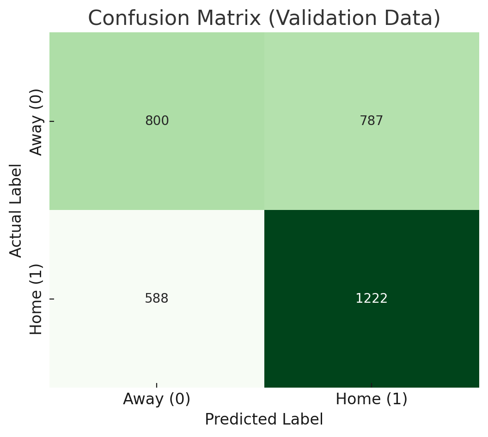
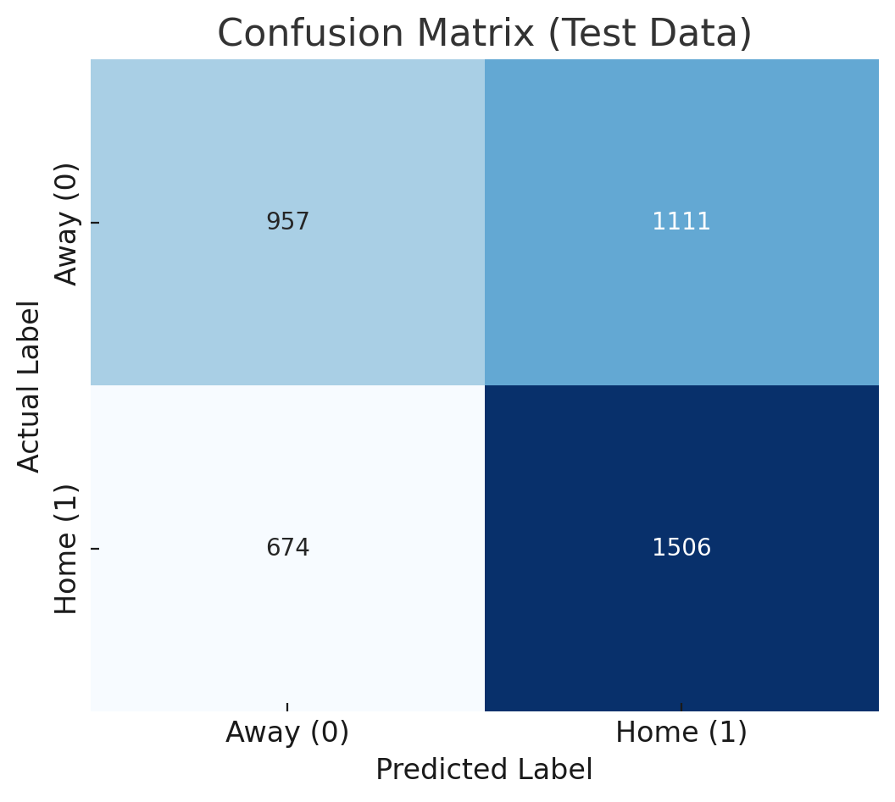

TODO: Add all other information from milestone 2, 3, 4 into report. All final milestones are on branch milestone4 readme

# Predicting Major League Baseball Game Outcomes: A Machine Learning Approach

## Table of Contents

- [Introduction](#introduction)
- [Methods](#methods)
  - [Data Exploration](#data-exploration)
  - [Preprocessing](#preprocessing)
  - [Model 1: Supervised Learning Baselines](#model-1-supervised-learning-baselines)
  - [Model 2: Unsupervised Clustering](#model-2-unsupervised-clustering)
- [Results](#results)
  - [Data Exploration Results](#data-exploration-results)
  - [Preprocessing Results](#preprocessing-results)
  - [Model 1 Results](#model-1-results)
  - [Model 2 Results](#model-2-results)
- [Discussion](#discussion)
  - [Data Exploration Discussion](#data-exploration-discussion)
  - [Preprocessing Discussion](#preprocessing-discussion)
  - [Model 1 Discussion](#model-1-discussion)
  - [Model 2 Discussion](#model-2-discussion)
- [Conclusion](#conclusion)
- [References](#references)

## Introduction

This project addresses the problem of predicting Major League Baseball (MLB) game outcomes, specifically whether the home team or away team will win a single game. The topic was chosen because it represents a classic application in sports analytics where machine learning techniques can be applied to a field with accessible historical data and unpredictability.We chose MLB because it combines rich public data with high game-to-game randomness, making it an ideal and genuinely interesting testbed for machine learning

The development of accurate predictive models for MLB games has a substantial impact on decision-making. Teams and franchises can leverage such models for strategic choices, including roster evaluation, performance assessment, and game-day strategy development. Media organizations and broadcasters benefit from enhanced fan engagement through data-driven pre-game analysis and win probability assessments that enrich commentary and storytelling. Additionally, these models serve as fundamental infrastructure for fantasy sports platforms and sports betting markets, where predictive accuracy directly influences financial outcomes for millions of participants. It’s cool precisely because even small, reproducible gains over simple baselines (e.g., the ~53% home-win prior) can meaningfully shift decisions and fan tools.

The significance of developing reliable predictive models extends beyond immediate applications. Baseball's inherent complexity, with its blend of individual and team performance factors, seasonal variations, and situational dynamics, makes even modest improvements in predictive accuracy a meaningful achievement for sports analytics and machine learning applications to real-world problems. Thus, modest but reliable improvements are scientifically meaningful and practically useful.

## Methods

### Data Exploration

The dataset was constructed using the pybaseball library to scrape comprehensive MLB data from Baseball-Reference, Baseball Savant, and FanGraphs. Data collection covered MLB regular seasons from 2016 to 2024, excluding the shortened 2020 season due to its atypical nature. The target variable home_win was defined as a binary indicator where 1 represents a home team victory and 0 represents an away team victory.

Initial data examination revealed 19,436 games with comprehensive game-level information including dates, team identifiers, and final scores. Season-level team statistics were integrated, encompassing batting metrics such as batting average, on-base percentage, slugging percentage, and on-base plus slugging (OPS), along with pitching statistics including earned run average (ERA) and walks plus hits per inning pitched (WHIP). The dataset structure included both categorical variables for teams, dates, and game conditions, and continuous variables for performance statistics.

 * season: int64 (19436 non-null) - The year of the MLB season.
   * date: object (19436 non-null) - The date of the game.
   * home_team: object (19436 non-null) - The home team's abbreviation.
   * away_team: object (19436 non-null) - The away team's abbreviation.
   * home_runs: float64 (19436 non-null) - The number of runs scored by the home team.
   * away_runs: float64 (19436 non-null) - The number of runs scored by the away team.
   * home_win: int64 (19436 non-null) - 1 if the home team won, 0 otherwise.
   * run_diff: float64 (19436 non-null) - The difference in runs (home - away).
   * month: int64 (19436 non-null) - The month of the game.
   * weekday: object (19436 non-null) - The day of the week of the game.
   * day_night: object (19436 non-null) - Whether the game was played during the day or at night.
   * home_league: object (19436 non-null) - The league of the home team.
   * away_league: object (18788 non-null) - The league of the away team.
   * is_interleague: int64 (19436 non-null) - 1 if the game was between teams from different leagues, 0 otherwise.
   * game_id: int64 (19436 non-null) - A unique identifier for the game.
   * home_BA: float64 (19436 non-null) - The home team's season batting average.
   * home_OBP: float64 (19436 non-null) - The home team's season on-base percentage.
   * home_SLG: float64 (19436 non-null) - The home team's season slugging percentage.
   * home_OPS: float64 (19436 non-null) - The home team's season on-base plus slugging.
   * home_season_runs: int64 (19436 non-null) - The home team's total runs for the season.
   * home_ERA: float64 (19436 non-null) - The home team's season earned run average.
   * home_WHIP: float64 (19436 non-null) - The home team's season walks and hits per inning pitched.
   * away_BA: float64 (18788 non-null) - The away team's season batting average.
   * away_OBP: float64 (18788 non-null) - The away team's season on-base percentage.
   * away_SLG: float64 (18788 non-null) - The away team's season slugging percentage.
   * away_OPS: float64 (18788 non-null) - The away team's season on-base plus slugging.
   * away_season_runs: float64 (18788 non-null) - The away team's total runs for the season.
   * away_ERA: float64 (18788 non-null) - The away team's season earned run average.
   * away_WHIP: float64 (18788 non-null) - The away team's season walks and hits per inning pitched.

### Preprocessing

Data cleaning procedures removed outcome-leaking features including home_runs, away_runs, and run_diff to prevent data leakage during model training. A comprehensive feature engineering pipeline was implemented to capture team matchup dynamics through differential and ratio calculations.

```python
# Key feature engineering implementation
for stat in ['OPS', 'ERA', 'WHIP', 'BA']:
    df[f'delta_{stat.lower()}'] = df[f'home_{stat}'] - df[f'away_{stat}']
    df[f'ratio_{stat.lower()}'] = df[f'home_{stat}'] / df[f'away_{stat}']
```

Rolling performance metrics were calculated to capture recent team form over 7, 10, and 15-game windows. These rolling averages utilized a shift(1) operation to ensure only prior game data was included, preventing temporal data leakage.

```python
# Rolling averages with leakage prevention
df['home_last10_win_pct'] = (
    df.groupby('home_team')['home_win']
    .shift(1).rolling(window=10, min_periods=1).mean()
)
```

Data partitioning used a temporal split strategy with 64% for training, 16% for validation, and 20% for testing, ensuring chronological order was preserved to simulate real-world prediction scenarios. A ColumnTransformer pipeline applied appropriate preprocessing to different feature types: numerical features received median imputation and standard scaling, categorical features received mode imputation and one-hot encoding, and polynomial features of degree 2 were generated for high-signal delta and ratio features. The final preprocessed feature space contained 81 features.

### Model 1: Supervised Learning Baselines

Four baseline supervised learning algorithms were implemented and evaluated: Gaussian Naive Bayes, Support Vector Machine with RBF kernel, Decision Tree, and K-Nearest Neighbors. Model-specific parameters were configured as follows: Decision Tree used max_depth=5 and min_samples_leaf=5, KNN employed n_neighbors=15, and SVM utilized C=2.0 with gamma='scale' and balanced class weights.

```python
from sklearn.svm import SVC
from sklearn.tree import DecisionTreeClassifier
from sklearn.neighbors import KNeighborsClassifier
from sklearn.naive_bayes import GaussianNB
from sklearn.metrics import accuracy_score

# Model configurations
models = {
    "SVM_RBF": SVC(C=2.0, gamma='scale', probability=True,
                   class_weight='balanced', random_state=42),
    "DecisionTree": DecisionTreeClassifier(max_depth=5, min_samples_leaf=5,
                                         random_state=42),
    "KNN": KNeighborsClassifier(n_neighbors=15),
    "NaiveBayes": GaussianNB()
}

# Training and evaluation loop
results = []
for name, model in models.items():
    model.fit(X_tr_dense, y_tr)
    train_pred = model.predict(X_tr_dense)
    val_pred = model.predict(X_va_dense)
    
    results.append({
        "model": name,
        "train_acc": accuracy_score(y_tr, train_pred),
        "val_acc": accuracy_score(y_va, val_pred)
    })
```

Hyperparameter optimization was conducted through grid search for each model. Naive Bayes var_smoothing parameter was tuned, Decision Tree max_depth and min_samples_leaf were optimized, and SVM C and gamma parameters were searched systematically to identify optimal configurations.

### Model 2: Unsupervised Clustering

Six unsupervised learning pipelines were developed combining dimensionality reduction techniques with clustering algorithms: PCA + KMeans, TruncatedSVD + KMeans, Non-negative Matrix Factorization + KMeans, PCA + Gaussian Mixture Models, SVD + GMM, and PCA + Agglomerative Clustering. Each pipeline underwent a hyperparameter search, varying the number of components for dimensionality reduction and the number of clusters (k) for clustering algorithms.

Model evaluation used both internal cluster quality metrics (Silhouette Score, Calinski-Harabasz Score, Davies-Bouldin Score) and external predictive performance assessment. For predictive evaluation, clusters were assigned class labels based on the majority class of training data within each cluster, and standard classification metrics were calculated on the test set.

```python
def cluster_conditional_predict(y_true: np.ndarray, labels_train: np.ndarray, labels_test: np.ndarray, threshold: float=0.5):
    stats = pd.DataFrame({"c": labels_train, "y": y_true}).groupby("c")["y"].agg(["size","sum"]).reset_index()
    stats["pos_rate"] = stats["sum"] / stats["size"].clip(lower=1)
    rate_map = dict(zip(stats["c"], stats["pos_rate"]))
    y_pred = np.array([1 if rate_map.get(c, 0.0) >= threshold else 0 for c in labels_test], dtype=int)
    return stats.rename(columns={"c":"cluster"}), y_pred
```

## Results

### Data Exploration Results

The final dataset contained 19,436 MLB games spanning the 2016-2024 seasons with comprehensive team and game-level statistics. Data quality assessment revealed complete coverage for most variables, with minor missing values in away team league designation (648 missing values). The target variable distribution showed a home field advantage with 53% of games won by home teams, providing a natural baseline for model comparison.

Team performance distributions demonstrated normal patterns for offensive statistics (OPS) and pitching metrics (ERA), with home teams showing slight advantages in offensive production. Temporal analysis revealed consistent patterns across seasons and months, with no significant data quality issues requiring additional cleaning beyond the initial preprocessing steps.

  
**Figure 1.** The distribution reveals that home team offensive performance follows a normal pattern with a slight advantage over away teams.

  
**Figure 2.** Away team offensive performance distribution demonstrates the typical spread of batting capabilities across MLB teams.

  
**Figure 3.** Home team pitching performance shows concentration around league-average ERA values.

  
**Figure 4.** Away team ERA distribution mirrors the home team pattern, indicating consistent pitching quality across venues.

  
**Figure 5.** The variation in home win rates across teams confirms the existence of home-field advantage while highlighting teams with particularly strong home performance.

### Preprocessing Results

Feature engineering successfully created 81 final features from the original dataset variables. Delta features captured relative team strengths with meaningful ranges (e.g., OPS differentials ranging from -0.3 to +0.3), while ratio features provided normalized comparisons between matchup opponents. Rolling performance calculations generated recent form metrics for 7, 10, and 15-game windows, with successful leakage prevention confirmed through temporal validation.

The ColumnTransformer pipeline processed all feature types appropriately, with numerical features standardized to zero mean and unit variance, categorical features expanded through one-hot encoding, and polynomial features capturing potential non-linear relationships. Missing value imputation affected less than 5% of the dataset, primarily in away team statistics for interleague games.

### Model 1 Results

Initial model comparison on validation data identified Naive Bayes as the top performer:

| Model | Training Accuracy | Validation Accuracy |
|-------|------------------|---------------------|
| **Naive Bayes** | **58.8%** | **59.5%** |
| SVM RBF | 62.3% | 58.4% |
| Decision Tree | 60.5% | 58.1% |
| KNN | 64.2% | 54.6% |

*Naive Bayes performance metrics*

The best-performing Naive Bayes model achieved 59.5% validation accuracy and 58.0% test accuracy, with macro F1-scores of 0.59 and 0.57 respectively. Hyperparameter optimization showed Naive Bayes was robust to var_smoothing parameter variations, maintaining stable performance across the tested range.

Test set confusion matrix for Naive Bayes revealed: True Positives (Home Wins): 1,506, True Negatives (Away Wins): 957, False Positives: 1,111, False Negatives: 674. These results demonstrate meaningful improvement over the 53% baseline accuracy from always predicting home team victories.

  
**Figure 6.** The validation set confusion matrix demonstrates the Naive Bayes model's classification performance across home and away win predictions.

  
**Figure 7.** The test set results confirm the model's generalization capability with consistent performance patterns.

### Model 2 Results

Internal cluster quality assessment showed NMF + KMeans achieved the highest silhouette score of 0.879, indicating well-separated, coherent clusters. Other pipelines demonstrated lower internal quality, with PCA/SVD + KMeans models scoring approximately 0.337 on silhouette metrics.

Predictive performance revealed an inverse relationship between cluster quality and predictive power. PCA + KMeans and SVD + KMeans achieved the best predictive performance with test F1-scores of 0.592 and test accuracy of 57.6%. The NMF + KMeans model, despite better cluster quality, showed no predictive capability and defaulted to majority class prediction.

Best unsupervised model performance (SVD + KMeans with k=2): Test Accuracy of 57.6%, Test F1-Score of 0.592, with confusion matrix values [[1041, 786], [864, 1197]] for [[TN, FP], [FN, TP]] respectively.

## Discussion

### Data Exploration Discussion

The dataset structure and quality were marginally sufficient for meaningful machine learning analysis. The 53% home win rate confirms the slight home field advantage in baseball, providing a reasonable baseline for model evaluation. The normal distributions observed in key performance metrics (OPS, ERA) align with expected statistical patterns in professional sports, suggesting the data captures genuine team performance differences rather than artifacts of data collection processes.

The comprehensive coverage from 2016-2024 provides substantial temporal depth while excluding the anomalous 2020 season (COVID) to maintain data consistency. Missing values were minimal and concentrated in predictable areas (interleague game designations).

### Preprocessing Discussion

The feature engineering strategy successfully captured team matchup dynamics through delta and ratio calculations. These engineered features represent meaningful baseball concepts: delta features directly measure team strength differences, while ratio features provide normalized comparisons that account for league-wide performance variations. The polynomial feature generation for high-signal features allowed the models to capture potential non-linear interactions between team strengths.

Rolling performance metrics captured recent team form, with the temporal leakage prevention through shift(1) operations ensuring model validity. The 81-feature final space represents a balance between comprehensive representation and computational tractability, though the dimensionality may have contributed to some overfitting in complex models like KNN.

### Model 1 Discussion

Naive Bayes was the best supervised learning baseline due to its strong generalization capability, as seen by the minimal train-validation accuracy gap (58.8% vs 59.5%). This negative gap suggests a slight underperformance on training data. The model is not overfitting and may generalize well to new data. The 58-59% accuracy range represents a meaningful improvement of 5-6% over the 53% baseline, though due to this low value we can acknowledge the fundamental unpredictability inherent in baseball games.

Other models showed worse patterns: KNN demonstrated significant overfitting (64.2% training vs 54.6% validation), suggesting the model memorized training patterns that did not generalize. SVM showed moderate overfitting, while Decision Tree performance fell between these extremes. The improved performance of Naive Bayes likely reflects its probabilistic nature and independence assumptions, which may be well-suited to the complex, partially independent factors influencing baseball game outcomes.

### Model 2 Discussion

The unsupervised learning models revealed fundamental trade-offs between internal cluster quality and external predictive power. NMF + KMeans produced structurally excellent clusters with high silhouette scores, suggesting the algorithm identified distinct, meaningful groupings in the feature space. However, these groupings were not correlated with game outcomes, indicating NMF may have clustered games based on non-predictive factors such as temporal patterns, league affiliations, or other structural elements.

On the other hand, PCA and SVD + KMeans produced lower-quality clusters but maintained some predictive capability. This pattern suggests these dimensionality reduction techniques captured variance components partially correlated with factors determining game outcomes. The 57.6% accuracy achieved by SVD + KMeans approaches the supervised learning performance while using no outcome information during training, indicating the presence of discoverable patterns in team performance data.

Improved approaches such as using cluster assignments as additional features in supervised models could potentially improve performance while maintaining the benefits of unsupervised learning.

## Conclusion

This project developed and evaluated machine learning approaches for predicting MLB game outcomes, achieving meaningful improvements over baseline predictions. The best supervised model (Naive Bayes) attained 58% test accuracy, representing a 5% improvement over the 53% home-field advantage baseline. The unsupervised exploration revealed trade-offs between cluster quality and predictive power, with SVD + KMeans showing promise for prediction tasks.

Future research directions should prioritize advanced feature engineering, such as incorporating player-level statistics such as starting pitcher matchups, injury reports, and recent performance streaks. Weather conditions, ballpark factors, and travel schedules represent additional feature categories that could enhance predictive accuracy. Model complexity improvements through Random Forest, XGBoost, or neural network implementations could capture more sophisticated pattern interactions.

Ensemble methods combining the strengths of different algorithms may be another possible direction, with weighted combinations of Naive Bayes and SVM models. A hybrid approach utilizing unsupervised cluster assignments as categorical features in supervised models could provide additional predictive power while maintaining interpretability.

If this project could be done differently, greater emphasis would be placed on detailed starting pitcher statistics and opponent-adjusted performance metrics, as these factors are known to significantly influence individual game outcomes. Implementing time-series cross-validation procedures such as walk-forward validation would also provide improved hyperparameter optimization and better simulate real-world deployment conditions. The inherent challenge of unpredictability in baseball games means that even modest accuracy improvements as small as 5% represent meaningful advances in sports analytics applications.

---
## Collaboration

*Sophia Vo, Role: Coder, Writer*
Contribution: Wrote code and README.md for Milestones 2, 3, 4. Wrote final report draft.

*Juan Pablo DeSilva, Role:*
Contribution: Wrote code and README.md for Milestones

*Sharon Huang, Role:*
Contribution: Wrote code and README.md for Milestones

*Mary Rong, Role:*
Contribution: Wrote code and README.md for Milestones

---

## Repository Structure and Documentation

### Current Project Organization
```
CSE-151A-Group-Project/
├── .venv/                          # Virtual environment
├── data/
│   └── raw/
│       └── games_2016-2024_Milestone3.csv # 2016-2024 MLB game data
├── figs/                           # Generated visualizations  
├── notebooks/
│   ├── milestone2_exploration.ipynb # Data exploration & preprocessing
│   ├── milestone3_modeling_2016-2024.ipynb # Model training & evaluation for 2016-2024
│   ├── milestone4_all_models.ipynb # All models from Milestone 4
│   └── outputs2/ # evaluation scores for Milestone 4 Models
├── .gitignore
├── README.md                       # Project documentation
└── requirements.txt               # Python dependencies
```

## Project Files
- **[milestone2_exploration.ipynb](notebooks/milestone2_exploration.ipynb)** - Data preprocessing and feature engineering (2016-2023)
- **[milestone3_modeling_2016-2024.ipynb](notebooks/milestone3_modeling_2016-2024.ipynb)** - Model training and optimization for MLB 2016-2024 seasons
- **[milestone4_all_models.ipynb](notebooks/milestone4_all_models.ipynb)** - All models from milestone 4
- **[games_2016-2024_Milestone3.csv](data/raw/games_2016-2024_Milestone3.csv)** - Raw MLB data for MLB 2016-2024 season

