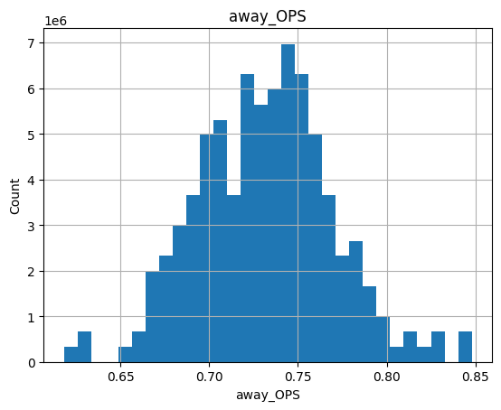

# MLB Game Outcome Prediction (Milestone 2)

**Goal:** Use the [pybaseball](https://pypi.org/project/pybaseball/) library to collect historical MLB data and explore it to prepare features for a decision tree classifier that predicts single-game outcomes (win/loss).

We will train a simple, interpretable DecisionTreeClassifier on features like team batting/pitching strength (BA, OPS, ERA), and recent form (e.g., last-10 win %). In Milestone 2 we focus on data exploration and explainign the initial preprocessing plan.

## Dataset

We will build our dataset with `pybaseball`, scrapping from:
- **PyPI: pybaseball**: https://pypi.org/project/pybaseball/  
- **Upstream data sources accessed by pybaseball**:  
  - Baseball-Reference (team game logs, schedules/records) — https://www.baseball-reference.com/  
  - Baseball Savant / Statcast (pitch- and batted-ball–level) — https://baseballsavant.mlb.com/  
  - FanGraphs (season/team batting & pitching leaderboards) — https://www.fangraphs.com/

We will fetch team `schedule-and-record` data and `team-level batting/pitching` metrics to derive features (e.g., rolling last-10 win%, OPS, ERA) in order to predict the `home_win` (1 = home team won, 0 = lost).

## Environment setup

- **Python**: 3.9–3.12  
- **Install** (virtualenv or conda):
  ```bash
  # if you are using venv
  python -m venv .venv
  source .venv/bin/activate  # Windows: .venv\Scripts\activate
  pip install -r requirements.txt
  ```
  ```bash
  # if you're using conda
  conda create -n mlb python=3.11 -y
  conda activate mlb
  pip install -r requirements.txt
  ```

- **Requirements** located in `requirements.txt`. (check pybaseball endpoints in case of change)

## Repo structure

```
.
├── data/
│   └── raw/ #for storing later raew csvs     
├── figs/           #for saving figures from notebook
├── notebooks/
│   └── milestone2_exploration.ipynb  
├── src/                    #later
├── requirements.txt
└── README.md
```

--- 
# The Data

## Observations

THe scope of our data is the 2023 MLB regular season *(we're changing this to expand)*
 - ~2.4k games per season (TODO)
 - Each row represents one game -> remove duplicates only take home team perspc 
 - target column to predict: `home_win` (1 if the home team won, else 0)


Features:
 Team:  battng stats eg BA, OBP, SLG, pitching stats etc -> have to compute these
 Recent form: rolling last-10 (or 7/15) game win %, recent runs scored/allowed per game etc etc
 other: day/night, doubleheader flag, interleague, etc


TODO: get from notebook outputs (need to upscale)

---

## Data plots

### Histograms of continuous features (e.g., OPS, ERA)




### Bar chart of home_win rate by team (sanity check for home-field advantage)


### Scatter: team OPS vs. win rate (league-wide)


### Rolling last-10 win % distribution.  


## Initial preprocessing plan (WIP)


# steps for Running everything

1. `notebooks/milestone2_exploration.ipynb` currently is a small scale testing notebook usable for pd for debugging purposes, will need to include more seasons. Currently it:
   - fetches 2023 data via `pybaseball`, 
   - builds game-level table with `home_win`,
   - print shapes/summaries
   - render the plots
2. Will need to save a CSV snapshot to `data/raw/games_2023.csv` (for reproducibility).

---

## Git instructions (make sure you're committing to the Milestone 2 branch for this assignment, merge requests to main branch will be handled later)

```bash
git checkout -b Milestone2 # move to branch
git add . #add files
git commit -m "whatever commit message you want" #commit
git push -u origin Milestone2 #submit
```

Make sure you git pull/fetch from branch before working/let others know if you're currently making edits to avoid merge conflicts
