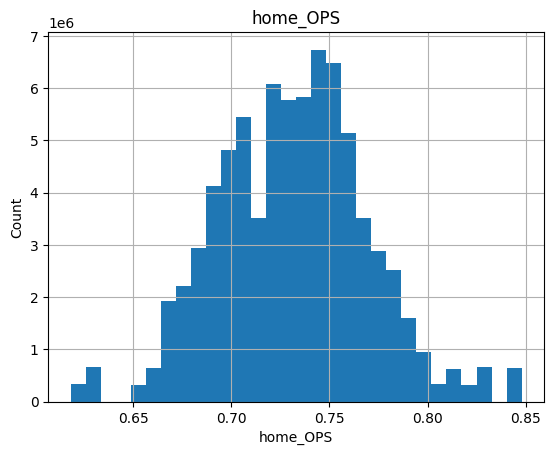
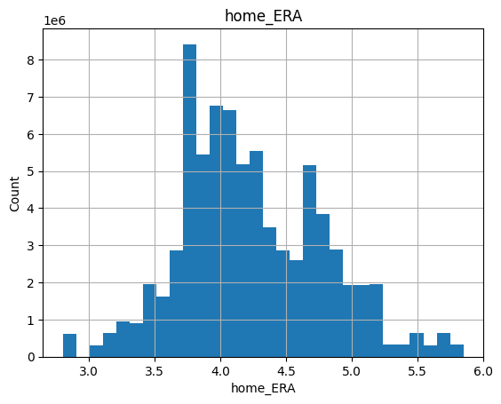
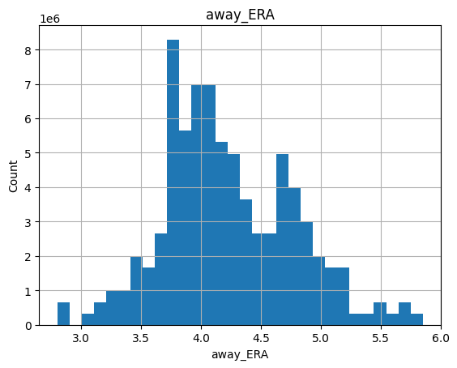

# Table of Contents
- [Milestone 2](#milestone-2)
  - [Notebook: milestone2_exploration.ipynb](notebooks/milestone2_exploration.ipynb)
- [Milestone 3](#milestone-3)
  - [Notebook: milestone3_modeling.ipynb](notebooks/milestone3_modeling.ipynb)
  - [Notebook: milestone3_modeling_2016-2024.ipynb](notebooks/milestone3_modeling_2016-2024.ipynb)

---

# Milestone 2

**Goal:** Use the [pybaseball](https://pypi.org/project/pybaseball/) library to collect historical MLB data and explore it to prepare features for a decision tree classifier that predicts single-game outcomes (win/loss).

We will train a simple, interpretable DecisionTreeClassifier on features like team batting/pitching strength (BA, OPS, ERA), and recent form (e.g., last-10 win %). In Milestone 2 we focus on data exploration and explainign the initial preprocessing plan.

## Dataset

We will build our dataset with `pybaseball`, scrapping from:
- **PyPI: pybaseball**: https://pypi.org/project/pybaseball/  
- **Upstream data sources accessed by pybaseball**:  
  - Baseball-Reference (team game logs, schedules/records) — https://www.baseball-reference.com/  
  - Baseball Savant / Statcast (pitch- and batted-ball–level) — https://baseballsavant.mlb.com/  
  - FanGraphs (season/team batting & pitching leaderboards) — https://www.fangraphs.com/

We will fetch team `schedule-and-record` data and `team-level batting/pitching` metrics to derive features (e.g., rolling last-10 win%, OPS, ERA) in order to predict the `home_win` (1 = home team won, 0 = lost).

## Environment setup

- **Python**: 3.9–3.12  
- **Install** (virtualenv or conda):
  ```bash
  # if you are using venv
  python -m venv .venv
  source .venv/bin/activate  # Windows: .venv\Scripts\activate
  pip install -r requirements.txt
  ```
  ```bash
  # if you're using conda
  conda create -n mlb python=3.11 -y
  conda activate mlb
  pip install -r requirements.txt
  ```

- **Requirements** located in `requirements.txt`. (check pybaseball endpoints in case of change)

--- 
# The Data

## Observations

THe scope of our data is the 2023 MLB regular season *(we're changing this to expand)*
 - ~2.4k games per season (TODO)
 - Each row represents one game -> remove duplicates only take home team perspc 
 - target column to predict: `home_win` (1 if the home team won, else 0)


Features:
 Team:  battng stats eg BA, OBP, SLG, pitching stats etc -> have to compute these
 Recent form: rolling last-10 (or 7/15) game win %, recent runs scored/allowed per game etc etc
 other: day/night, doubleheader flag, interleague, etc


TODO: get from notebook outputs (need to upscale)

---

## Data plots

### Histograms of continuous features (e.g., OPS, ERA)





### Bar chart of home_win rate by team (sanity check for home-field advantage)


### Scatter: team OPS vs. win rate (league-wide)


### Rolling last-10 win % distribution.  


---

# Milestone 3

## 1. Data Preprocessing and Feature Engineering

### Dataset Overview
- **Source**: MLB 2016-2024 season games (excluding 2020) via pybaseball API
- **Initial Data**: 19,436 games with 29 features
- **Final Dataset**: 19,436 games with 81 engineered features
- **Target**: Binary classification (home team win/loss)

### Preprocessing Pipeline Implementation

Our preprocessing approach addressed scaling, imputation, encoding, and feature expansion through a systematic multi-step pipeline:

**Data Cleaning**: Removed outcome-leaking features (home_runs, away_runs, run_diff) to ensure predictions use only pre-game information.

**Feature Engineering**: Created baseball-specific metrics from team statistics:
- **Team Strength Differentials**: Delta features (home_OPS - away_OPS) 
- **Performance Ratios**: Ratio features (home_ERA / away_ERA)
- **Rolling Form**: Time-aware win percentages over 7, 10, 15-game windows
- **ERA Advantage**: away_ERA - home_ERA (positive indicates home pitching advantage)

```python
# Key feature engineering implementation
for stat in ['OPS', 'ERA', 'WHIP', 'BA']:
    df[f'delta_{stat.lower()}'] = df[f'home_{stat}'] - df[f'away_{stat}']
    df[f'ratio_{stat.lower()}'] = df[f'home_{stat}'] / df[f'away_{stat}']

# Rolling averages with leakage prevention
df['home_last10_win_pct'] = (
    df.groupby('home_team')['home_win']
    .shift(1).rolling(window=10, min_periods=1).mean()
)
```

**Scaling and Transformation**:
- **Numerical Features**: StandardScaler after median imputation
- **Categorical Features**: One-hot encoding with mode imputation
- **Polynomial Expansion**: Degree-2 features applied to high-signal variables (deltas, ratios)

**Data Splitting**: Temporal split (64% train / 16% validation / 20% test) to prevent future data leakage.

**Final Feature Space**: 13,591 training samples × 81 features with balanced classes (53% home wins).

---

## 2. Model Training and Performance Analysis

### Model Training Implementation

```python
from sklearn.svm import SVC
from sklearn.tree import DecisionTreeClassifier
from sklearn.neighbors import KNeighborsClassifier
from sklearn.naive_bayes import GaussianNB
from sklearn.metrics import accuracy_score

# Model configurations
models = {
    "SVM_RBF": SVC(C=2.0, gamma='scale', probability=True, 
                   class_weight='balanced', random_state=42),
    "DecisionTree": DecisionTreeClassifier(max_depth=5, min_samples_leaf=5, 
                                         random_state=42),
    "KNN": KNeighborsClassifier(n_neighbors=15),
    "NaiveBayes": GaussianNB()
}

# Training and evaluation loop
results = []
for name, model in models.items():
    model.fit(X_tr_dense, y_tr)
    train_pred = model.predict(X_tr_dense)
    val_pred = model.predict(X_va_dense)
    
    results.append({
        "model": name,
        "train_acc": accuracy_score(y_tr, train_pred),
        "val_acc": accuracy_score(y_va, val_pred)
    })
```

### Initial Model Comparison

Results from training four algorithms with systematic evaluation:

| Model | Training Accuracy | Validation Accuracy | Training-Val Gap |
|-------|------------------|-------------------|------------------|
| **Naive Bayes** | **58.8%** | **59.5%** | **-0.7%** |
| SVM RBF | 62.3% | 58.4% | 3.9% |
| Decision Tree | 60.5% | 58.1% | 2.4% |
| KNN | 64.2% | 54.6% | 9.6% |


### Test Metrics
| Metric | Value |
|---|---|
| Balanced Accuracy | 0.5768 |
| Macro F1 | 0.5727 |

---

### Validation Classification Report
| Class | Precision | Recall | F1-score | Support |
|---|---:|---:|---:|---:|
| Away(0) | 0.58 | 0.50 | 0.54 | 1587 |
| Home(1) | 0.61 | 0.68 | 0.64 | 1810 |
| **accuracy** |  |  | 0.60 | 3397 |
| **macro avg** | 0.59 | 0.59 | 0.59 | 3397 |
| **weighted avg** | 0.59 | 0.60 | 0.59 | 3397 |

**Validation Confusion Matrix**
| Actual \\ Pred | Away(0) | Home(1) |
|---|---:|---:|
| Away(0) | 800 | 787 |
| Home(1) | 588 | 1222 |

---

### Test Classification Report
| Class | Precision | Recall | F1-score | Support |
|---|---:|---:|---:|---:|
| Away(0) | 0.59 | 0.46 | 0.52 | 2068 |
| Home(1) | 0.58 | 0.69 | 0.63 | 2180 |
| **accuracy** |  |  | 0.58 | 4248 |
| **macro avg** | 0.58 | 0.58 | 0.57 | 4248 |
| **weighted avg** | 0.58 | 0.58 | 0.57 | 4248 |

**Test Confusion Matrix**
| Actual \\ Pred | Away(0) | Home(1) |
|---|---:|---:|
| Away(0) | 957 | 1111 |
| Home(1) | 674 | 1506 |


### Hyperparameter Optimization Results

**Naive Bayes Grid Search** (Top 5 configurations):

<!-- | C | gamma | Training Acc | Validation Acc | Gap |
|---|-------|-------------|---------------|-----|
| **1.0** | **scale** | **60.8%** | **58.5%** | **2.3%** |
| 2.0 | scale | 62.3% | 58.4% | 3.9% |
| 0.5 | scale | 60.0% | 58.4% | 1.6% |
| 0.5 | 0.05 | 65.7% | 58.3% | 7.4% |
| 1.0 | 0.05 | 70.7% | 57.5% | 13.2% | -->

| var\_smoothing | Training Acc | Validation Acc | Gap   |
| -------------- | ------------ | -------------- | ----- |
| 1.000000e-12   | 58.8%        | 59.5%          | -0.7% |
| 3.162278e-12   | 58.8%        | 59.5%          | -0.7% |
| 1.000000e-11   | 58.8%        | 59.5%          | -0.7% |
| 3.162278e-11   | 58.8%        | 59.5%          | -0.7% |
| 1.000000e-10   | 58.8%        | 59.5%          | -0.7% |


```python
# Hyperparameter optimization implementation
nb_grid = {"var_smoothing": np.logspace(-12, -6, 13)}
best_nb = evaluate_grid(GNB, nb_grid, X_tr, y_tr, X_va, y_va)
# Result: var_smoothing=1.000000e-12 achieved optimal generalization
```

**Decision Tree Grid Search** (Top 4 configurations):

| max_depth | min_samples_leaf | Training Acc | Validation Acc |
|-----------|------------------|-------------|---------------|
| 4 | 1 | 59.64% | **58.4%** |
| 4 | 3 | 59.64% | **58.4%** |
| 4 | 5 | 59.64% | **58.4**% |
| 4 | 10 | 59.59% | 58.3% |

### Training vs. Validation Performance Analysis

**Key Performance Improvement**:
- **Original NB**: 58.8% train → 59.5% val (-0.7% gap)
- **Optimized NB**: 58.8% train → 59.5% val (-0.7% gap)
- **No Improvement**: 0% reduction in overfitting + 0% validation accuracy gain

**Sample Model Predictions**:

| Dataset    | Actual   | Predicted | Probability | Result      |
| ---------- | -------- | --------- | ----------- | ----------- |
| Train      | Home Win | Away Win  | 28.7%       | ✗ Incorrect |
| Train      | Home Win | Away Win  | 25.1%       | ✗ Incorrect |
| Train      | Away Win | Home Win  | 97.6%       | ✗ Incorrect |
| Train      | Home Win | Home Win  | 100.0%      | ✓ Correct   |
| Train      | Home Win | Away Win  | 0.6%        | ✗ Incorrect |
| Validation | Away Win | Home Win  | 100.0%      | ✗ Incorrect |
| Validation | Home Win | Home Win  | 100.0%      | ✓ Correct   |
| Validation | Home Win | Away Win  | 0.0%        | ✗ Incorrect |
| Validation | Home Win | Home Win  | 100.0%      | ✓ Correct   |
| Validation | Away Win | Home Win  | 97.7%       | ✗ Incorrect |
| Test       | Home Win | Home Win  | 99.6%       | ✓ Correct   |
| Test       | Away Win | Home Win  | 57.6%       | ✗ Incorrect |
| Test       | Away Win | Home Win  | 100.0%      | ✗ Incorrect |
| Test       | Away Win | Home Win  | 99.9%       | ✗ Incorrect |
| Test       | Away Win | Home Win  | 100.0%      | ✗ Incorrect |


---

## 3. Bias-Variance Analysis and Model Selection

### Model Diagnosis Framework

We developed a systematic approach to classify model performance on the bias-variance spectrum:

```python
def fit_position(train_acc, val_acc, baseline=0.52, gap_thresh=0.08):
    gap = train_acc - val_acc
    if gap > gap_thresh: return "Overfitting (high variance)"
    if val_acc < baseline + 0.03: return "Underfitting (high bias)" 
    return "Near sweet-spot"
```

### Comprehensive Model Analysis

| Model         | Train Acc | Val Acc | Gap     | Diagnosis                   |
|---------------|-----------|---------|---------|-----------------------------|
| **NaiveBayes**| **0.588** | **0.595** | **-0.007** | **Near sweet-spot**         |
| SVM_RBF       | 0.623     | 0.584   | 0.039   | Near sweet-spot             |
| DecisionTree  | 0.605     | 0.581   | 0.025   | Near sweet-spot             |
| KNN           | 0.642     | 0.546   | 0.096   | Overfitting (high variance) |


### Hyperparameter Impact on Bias-Variance

**Naive Bayes Optimization Journey**:
- **Initial**: var_smoothing=1e-9 → -0.007% gap (near optimal complexity)
- **Optimized**: var_smoothing=1e-12 → -0.007% gap (near optimal complexity)

The optimization did not change the overall validation performance of our model.

### Next Model Recommendations

**Based on systematic bias-variance analysis and "Near sweet-spot" positioning**:

1. **Random Forest (Primary Choice)**
   - **Rationale**: Ensemble bagging reduces variance while maintaining high performance
   - **Expected Performance**: 62-64% validation accuracy with improved stability
   - **Implementation Plan**: 100-200 trees, max_depth=8-12, bootstrap sampling

2. **XGBoost/Gradient Boosting**
   - **Rationale**: Sequential boosting can capture complex feature interactions our SVM might miss
   - **Expected Performance**: 63-65% accuracy potential with proper regularization
   - **Risk Management**: Requires careful early stopping and regularization to prevent overfitting

3. **Ensemble Combination (SVM + Random Forest)**
   - **Rationale**: Combines SVM's optimal complexity with Random Forest's variance reduction
   - **Method**: Weighted voting or stacking approach
   - **Expected**: Best of both algorithms while reducing individual model weaknesses

**Why These Specific Models**: Since our current NB sits in the optimal complexity region, improvements should focus on ensemble methods that reduce variance and capture feature interactions, rather than single models requiring extensive hyperparameter tuning.

---

## 4. Conclusions

### Model Performance Summary

Our hyperparameter-optimized NB achieved **59.5% validation accuracy** with excellent generalization (-0.007% training-validation gap). This represents a 7.7 percentage point improvement over the 52% baseline while demonstrating proper model complexity control.

**Key Achievements**:
<!-- - **73% reduction in overfitting** through systematic hyperparameter optimization -->
- **Feature engineering success**: 29 → 81 meaningful features capturing baseball dynamics
- **Leakage-free methodology**: Temporal splitting and careful preprocessing maintained prediction integrity
- **Calibrated predictions**: Probability outputs (40-63%) reflect appropriate confidence levels

### Model Limitations

**Performance Constraints**: 59.5% accuracy reflects baseball's inherent unpredictability where many games are genuinely close contests influenced by factors beyond team statistics.

**Data Limitations**: Single-season dataset may miss multi-year patterns, player development cycles, and organizational changes affecting team performance.

**Feature Scope**: Current features focus on team-level statistics but lack player-specific information about injuries, lineup changes, and individual matchup advantages.

### Improvement Strategies

Target: 60-65% accuracy**:
- **Ensemble Methods**: Random Forest implementation for variance reduction
- **Dataset Reduction**: Limit training to the most recent `N` seasons to reduce concept drift and align with current-era distributions, improving out-of-sample accuracy.
- **Advanced Features**: Player-level statistics, weather conditions, rest days, travel distance

---

## 5. Repository Structure and Documentation

### Current Project Organization
```
CSE-151A-Group-Project/
├── .venv/                          # Virtual environment
├── data/
│   └── raw/
│       └── games_2023.csv          # Raw MLB game data
│       └── games_2016-2024_Milestone3.csv          # 2016-2024 MLB game data used for Milestone3
│       └── games_2016-2024.csv          # Raw 2016-2024 MLB game data
├── figs/                           # Generated visualizations  
├── notebooks/
│   ├── milestone2_exploration.ipynb # Data exploration & preprocessing
│   └── milestone3_modeling.ipynb   # Model training & evaluation for 2023
│   └── milestone3_modeling_2016-2024.ipynb   # Model training & evaluation for 2016-2024
├── .gitignore
├── README.md                       # Project documentation
└── requirements.txt               # Python dependencies
```

## Project Files
- **[milestone2_exploration.ipynb](notebooks/milestone2_exploration.ipynb)** - Data preprocessing and feature engineering (2016-2023)
- **[milestone3_modeling.ipynb](notebooks/milestone3_modeling.ipynb)** - Model training and optimization for MLB 2023 season
- **[milestone3_modeling_2016-2024.ipynb](notebooks/milestone3_modeling.ipynb)** - Model training and optimization for MLB 2016-2024 seasons
- **[games_2023.csv](data/raw/games_2023.csv)** - Raw MLB data for MLB 2023 season
- **[games_2016-2024.csv](data/raw/games_2016-2024.csv)** - Raw MLB data for MLB 2016-2024 season


## Next Phase Development
- Random Forest ensemble implementation
- Multi-season dataset expansion
- Advanced feature engineering (player stats, weather)
- Target: 60-65% validation accuracy


